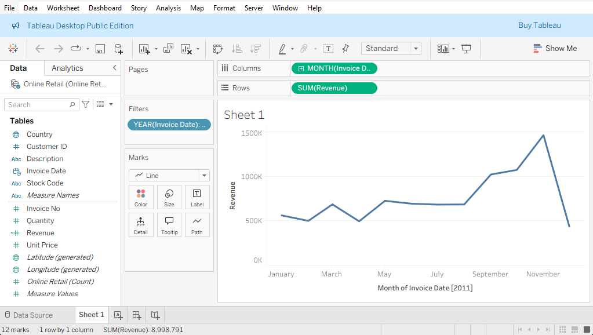
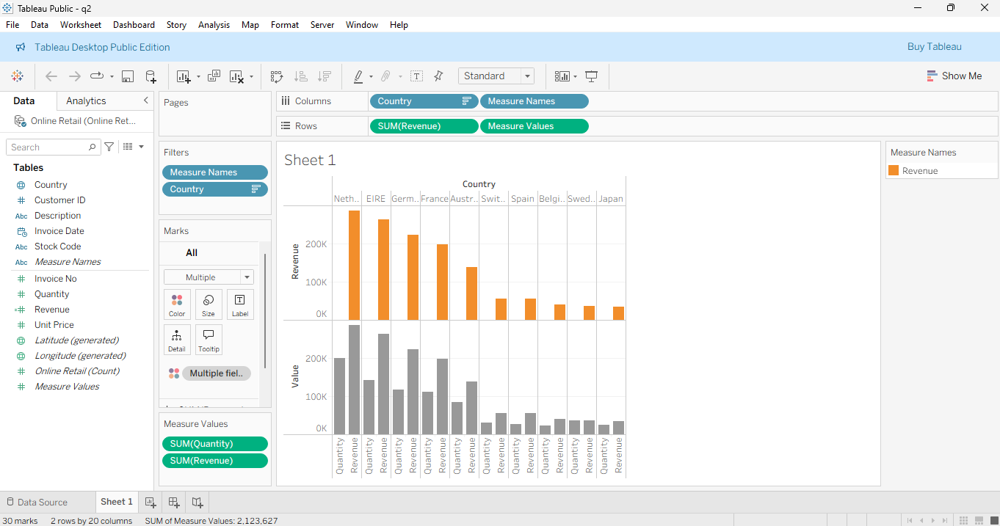
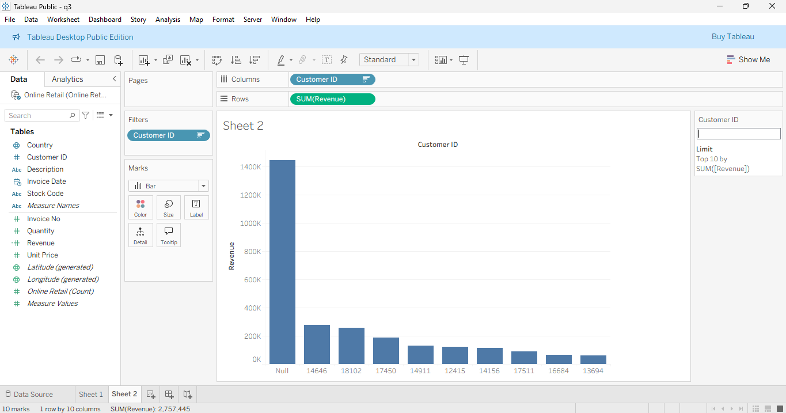
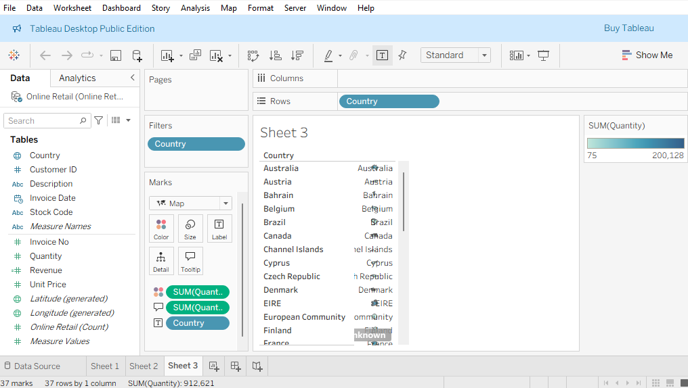

# Tata Data Visualization using Tableau

## 📌 Overview

This project presents an interactive Tableau-based data visualization solution for analyzing an online retail dataset. The dashboards provide insights into sales performance, customer purchasing behavior, country-wise revenue, and geographical sales distribution to support data-driven business decisions.

---

## 🎯 Objective

The objective of this project is to analyze retail sales data and answer key business questions through interactive visualizations, enabling stakeholders to identify sales trends, top-performing markets, high-value customers, and regional demand patterns.

---

## 📊 Dataset

**Dataset:** Online Retail Dataset

The dataset contains transactional retail sales data, including:

- Invoice Date
- Customer ID
- Country
- Product Description
- Quantity
- Unit Price
- Revenue

---

## 🛠️ Tech Stack

- Tableau
- Data Visualization
- Business Analytics
- Dashboard Design

---

## 📈 Business Questions

This project answers the following business questions:

1. How does monthly revenue change throughout the year?
2. Which countries generate the highest revenue?
3. Who are the highest-value customers?
4. Which regions contribute the highest sales volume?

---

## 📊 Dashboards

### Dashboard 1 – Monthly Revenue Trend

Analyzes monthly revenue across the year to identify seasonal sales trends and revenue growth.

---

### Dashboard 2 – Country-wise Revenue & Quantity

Compares revenue and quantity sold across top-performing countries.

---

### Dashboard 3 – Top Customers by Revenue

Identifies the highest revenue-generating customers and highlights customer purchasing patterns.

---

### Dashboard 4 – Geographic Sales Distribution

Visualizes quantity sold across different countries to understand regional demand.

---

## 📌 Key Insights

- Revenue remained relatively stable during the first half of the year before increasing significantly in the final quarter.
- November recorded the highest monthly revenue.
- The Netherlands generated the highest revenue among all countries.
- High-value customers contributed a significant portion of total revenue.
- Geographic visualization highlighted demand across multiple international markets.
- The presence of missing Customer IDs indicates potential opportunities for improving data quality.

---

## 💡 Skills Demonstrated

- Data Visualization
- Business Intelligence
- Dashboard Design
- Exploratory Data Analysis
- Business Storytelling
- Retail Sales Analytics

---

## ▶️ How to View

1. Download any of the `.twbx` Tableau workbook files.
2. Open the file using Tableau Public or Tableau Desktop.
3. Explore the interactive visualizations.

---

## 🚀 Future Improvements

- Build an interactive dashboard combining all visualizations.
- Add KPI cards for revenue, customers, and sales.
- Integrate filters for year, country, and product category.
- Connect to live retail datasets for real-time analysis.

---

## 📄 License

This project is licensed under the MIT License.

---

## 👨‍💻 Author

**Rayyan Abdul Waheed**

GitHub: https://github.com/rayyan4676t7
